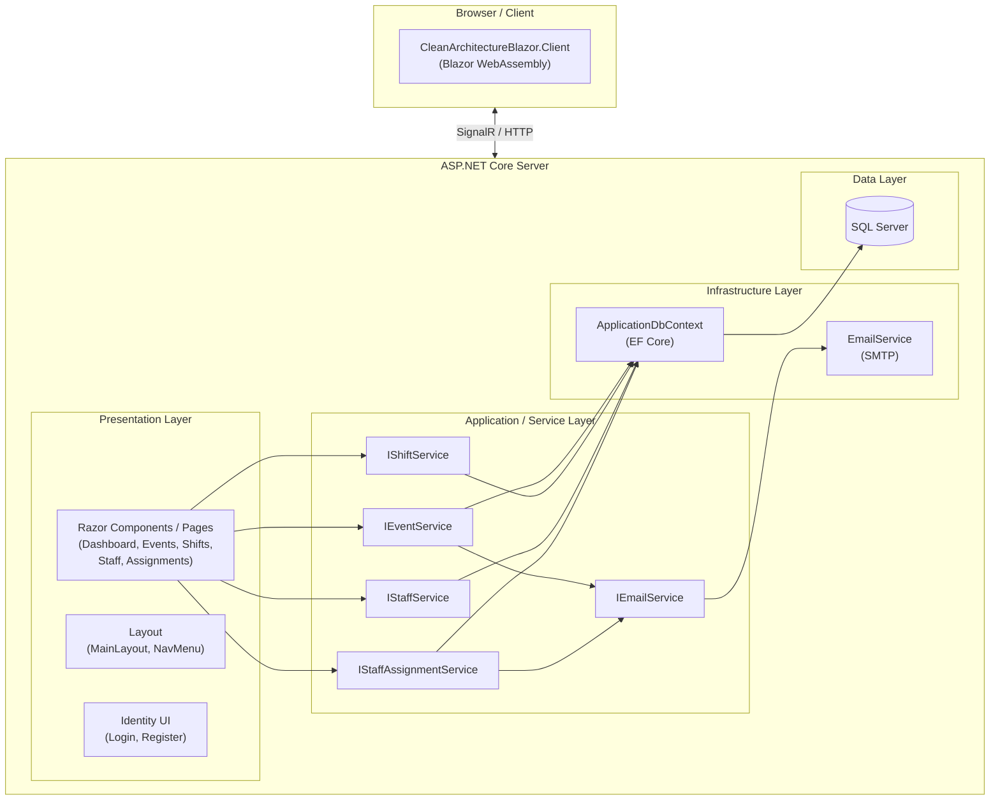
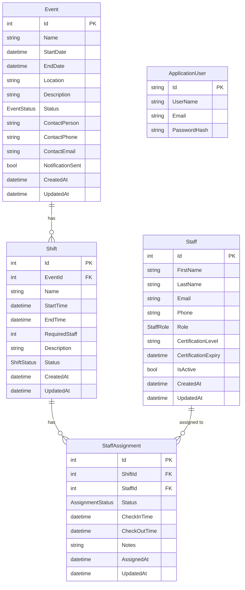
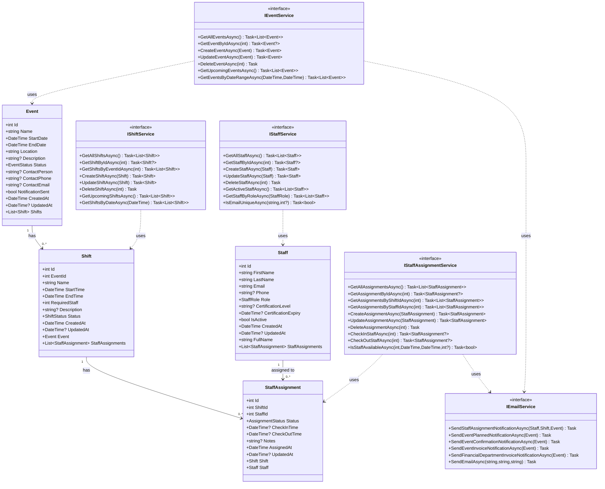
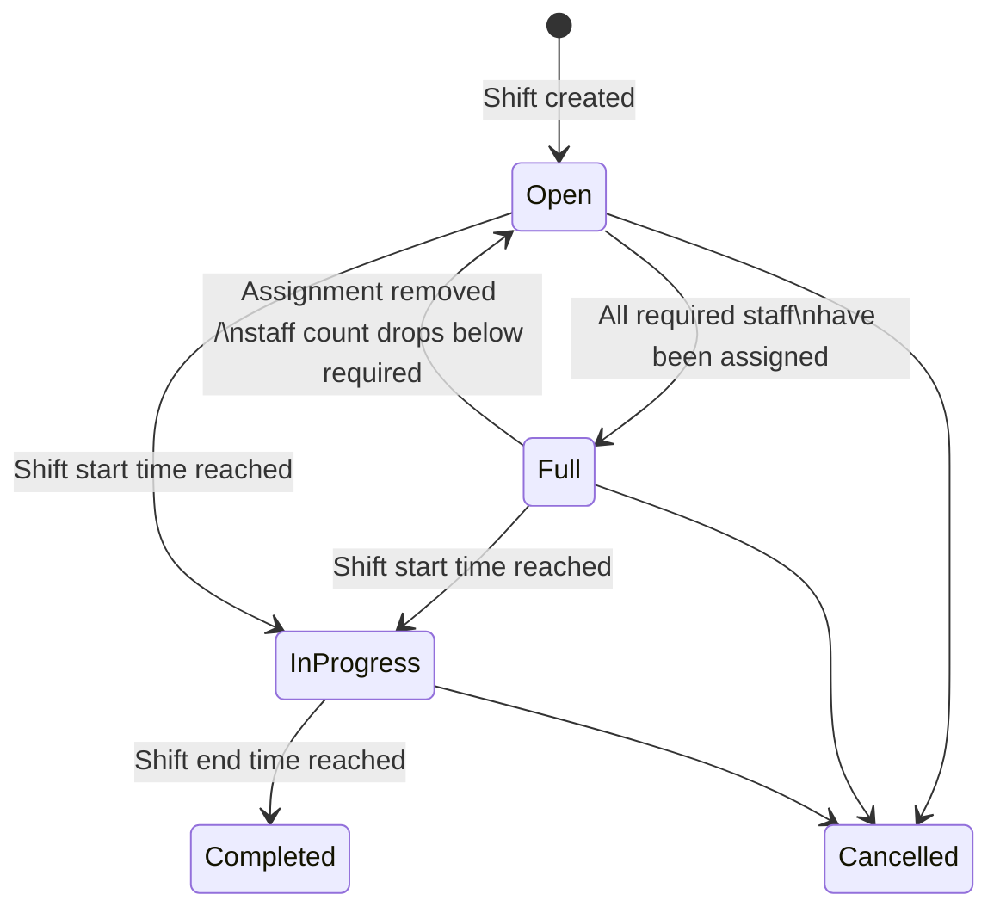
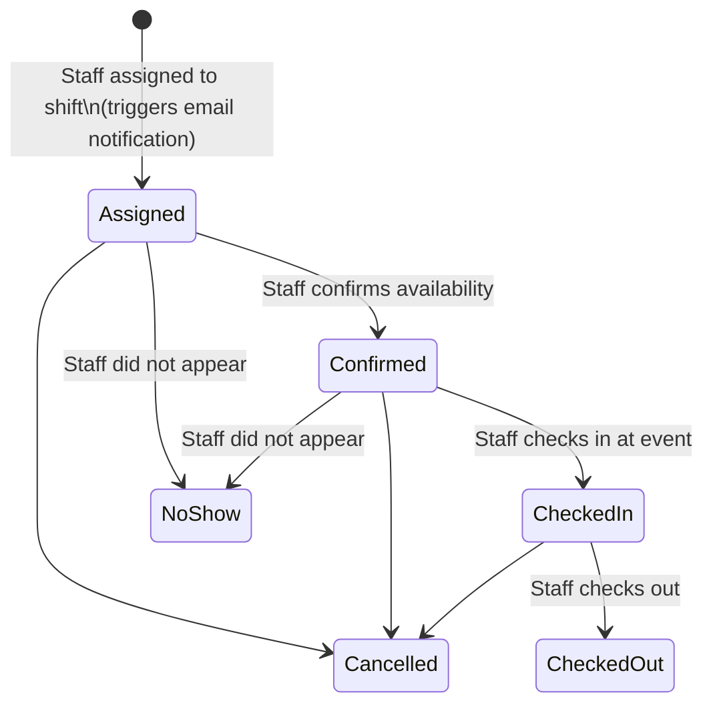
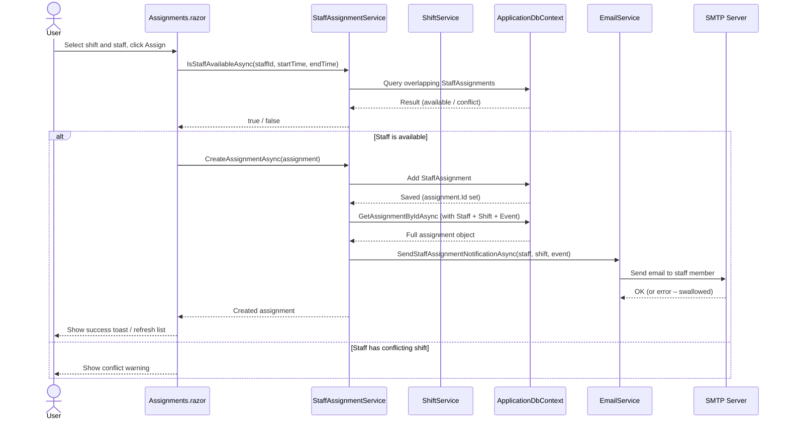
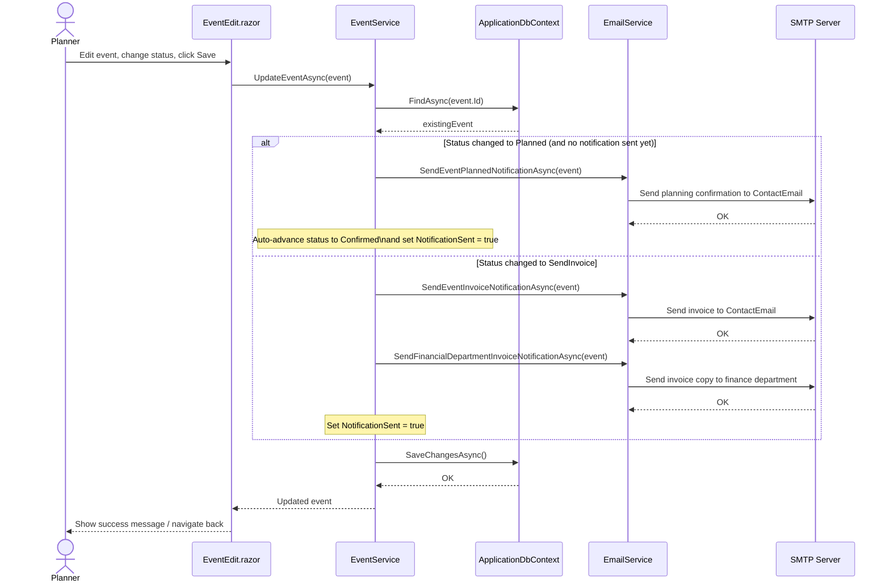
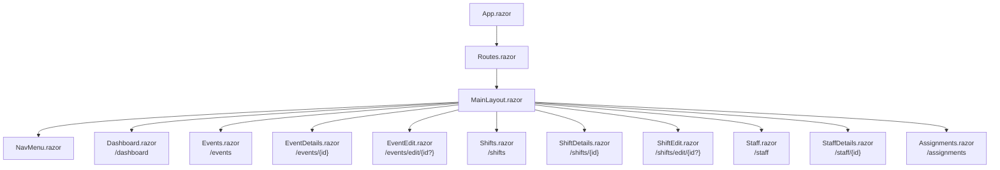
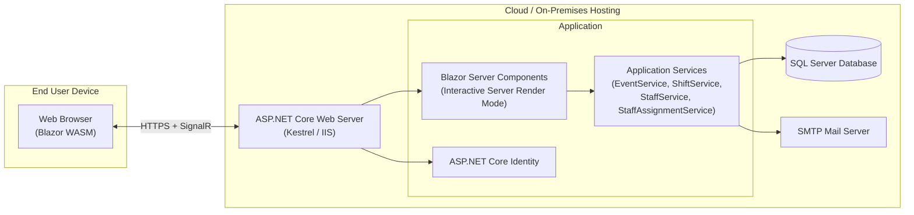

# Solution Diagrams

Mermaid diagrams describing the architecture, data model, service interactions, and workflows of the **Medical First Aid Event & Shift Manager** Blazor application.

---

## 1. Solution Architecture

High-level view of the two projects and their layers.

---

## 2. Entity Relationship Diagram

---

## 3. Class Diagram – Models and Services

---

## 4. EventStatus State Machine

```mermaid
stateDiagram-v2
    [*] --> Requested : Event created

    Requested --> Planned : Planner confirms planning\n(triggers confirmation email\nto contact → auto-advances to Confirmed)
    Planned --> Confirmed : Email sent successfully
    Confirmed --> Active : Event day starts
    Active --> Completed : Event finishes
    Completed --> SendInvoice : Invoice is ready\n(triggers invoice email\nto contact + finance dept)
    SendInvoice --> [*]

    Requested --> Cancelled
    Planned --> Cancelled
    Confirmed --> Cancelled
    Active --> Cancelled
```

---

## 5. ShiftStatus State Machine

---

## 6. AssignmentStatus State Machine

---

## 7. Sequence Diagram – Assigning Staff to a Shift

---

## 8. Sequence Diagram – Updating Event Status with Email Notifications

---

## 9. Component Hierarchy – Blazor Pages

---

## 10. Deployment / Infrastructure Overview

