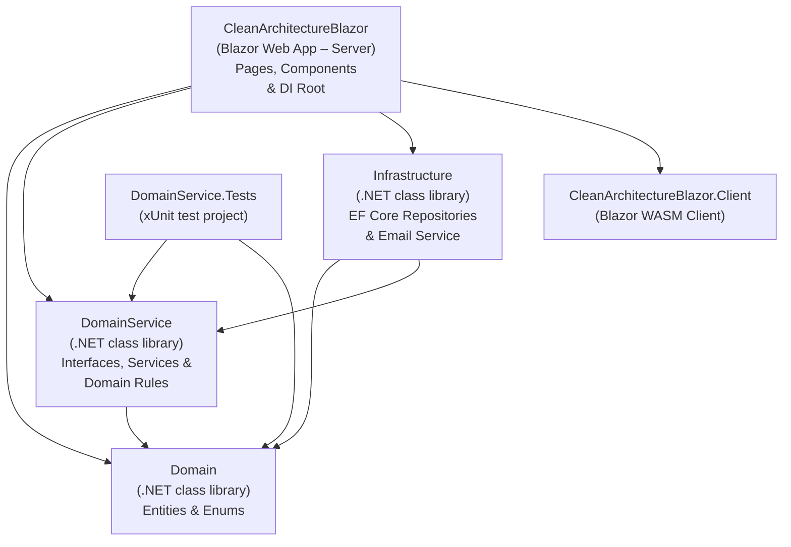
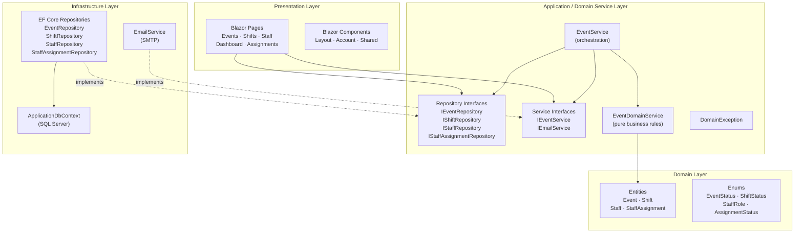
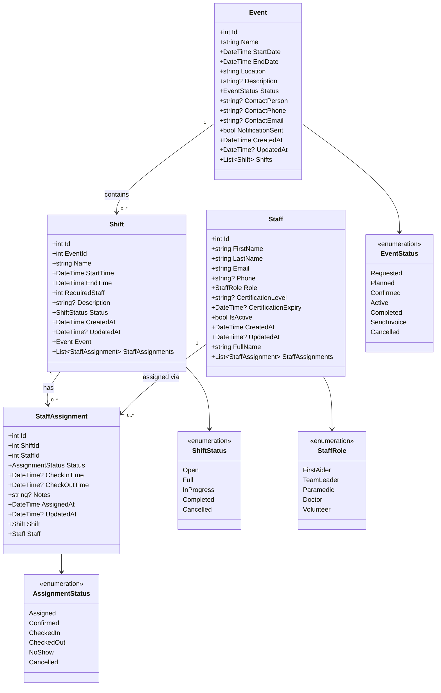
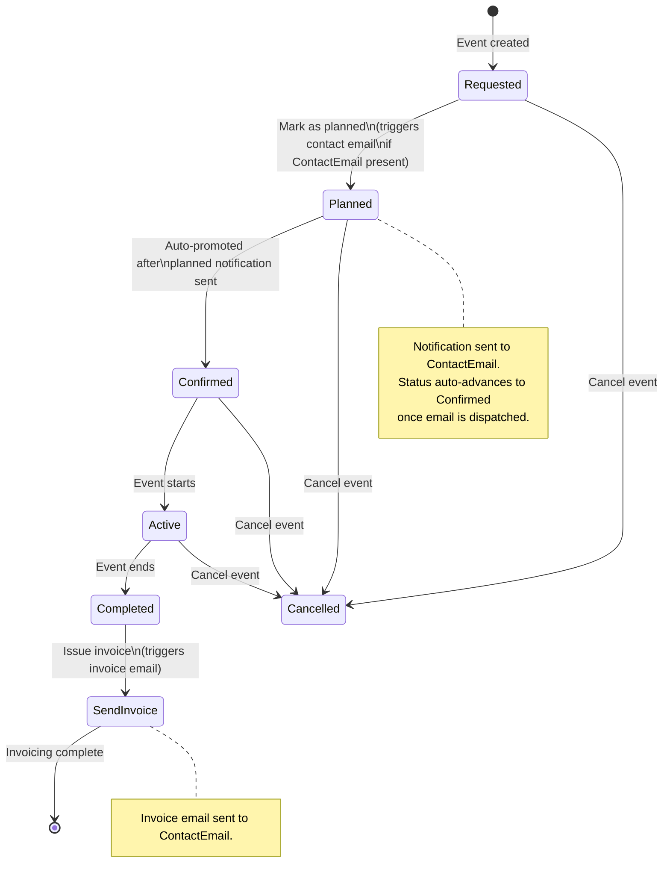
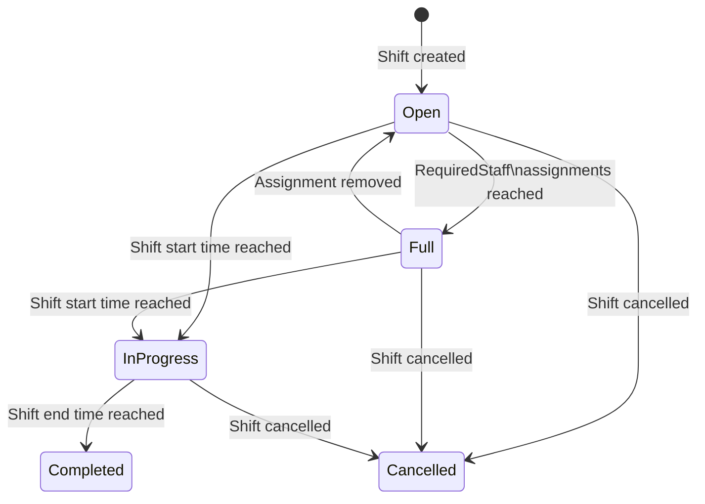
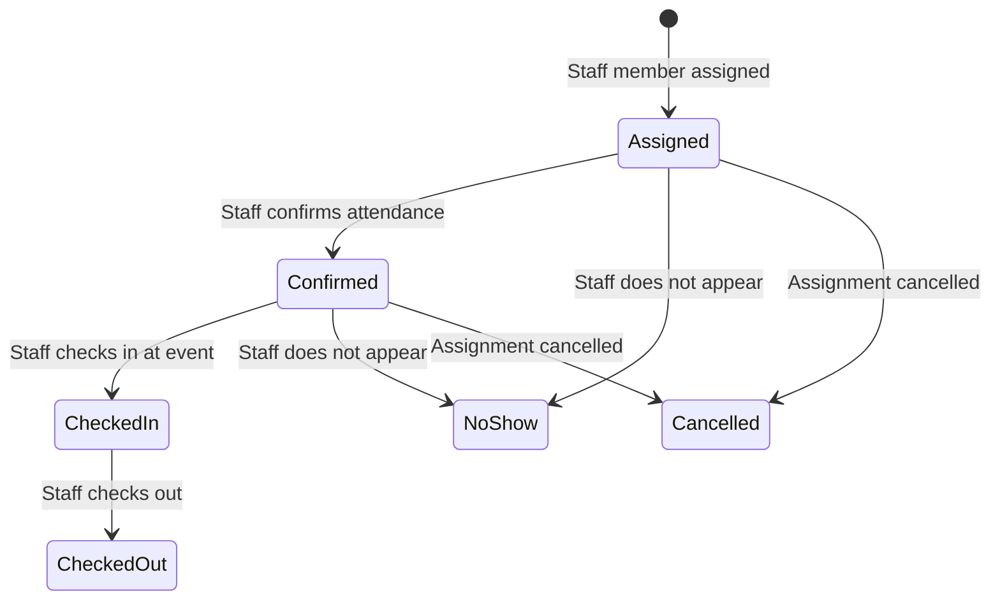
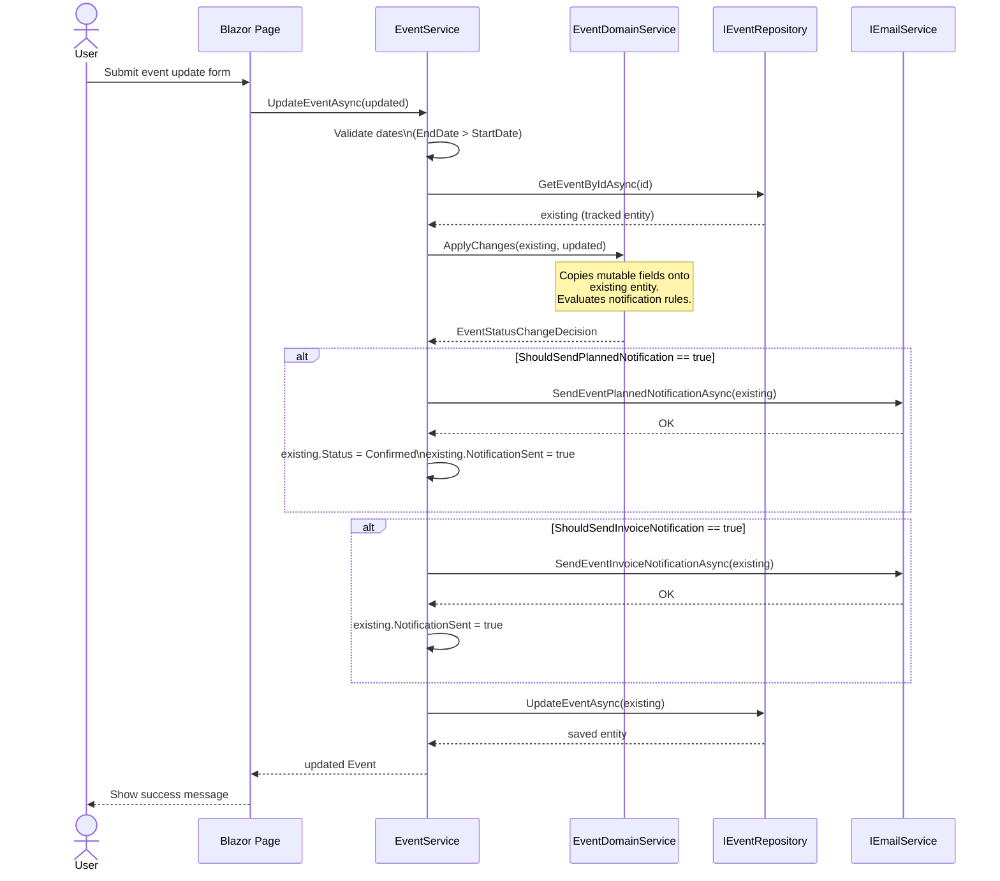
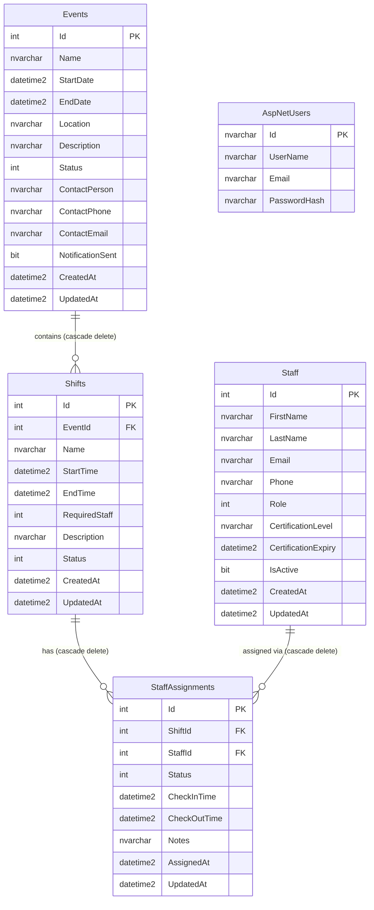

# Solution Architecture Diagrams

This document contains Mermaid diagrams describing the structure and behaviour of the Medical First Aid Event & Shift Manager.

---

## 1. Project Dependency Graph

Shows how the .NET projects in the solution reference each other.

---

## 2. Clean Architecture Layer Diagram

Illustrates the layered architecture and the direction of allowed dependencies (inner layers have no knowledge of outer layers).

---

## 3. Domain Class Diagram

Entity relationships and their properties.

---

## 4. Event Status State Machine

The lifecycle of an `Event` from creation through completion and invoicing.

---

## 5. Shift Status State Machine

The lifecycle of a `Shift` within an event.

---

## 6. Staff Assignment Status State Machine

Tracks attendance and duty status for a single staff member assigned to a shift.

---

## 7. Update Event Sequence Diagram

Detailed flow through `EventService.UpdateEventAsync`, including domain rules and email side-effects.

---

## 8. Database Entity-Relationship Diagram

