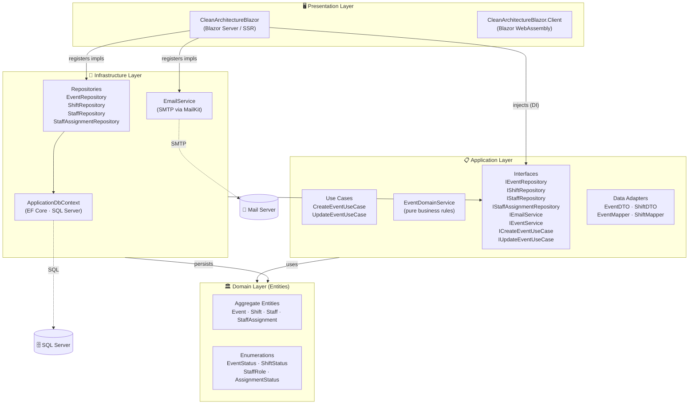
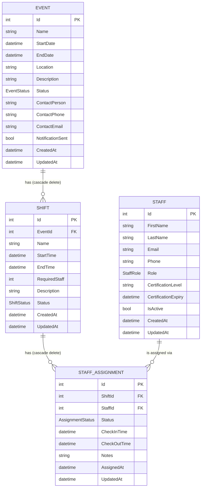
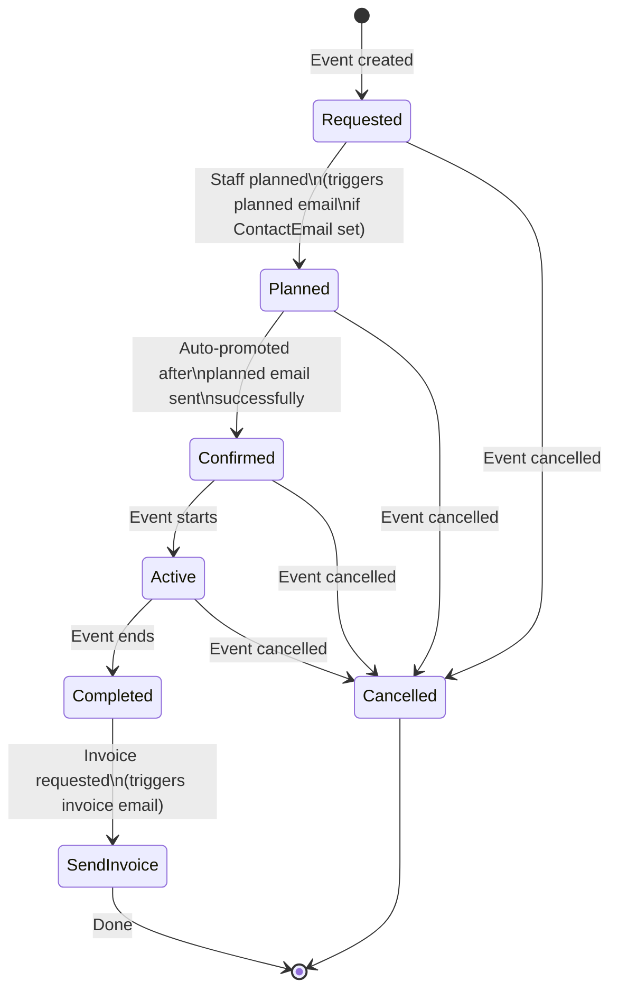
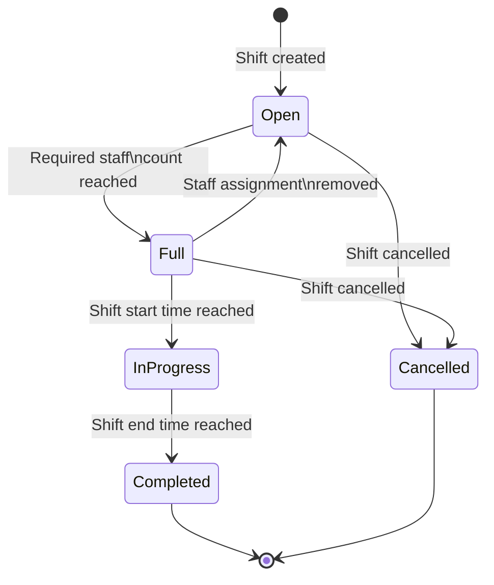
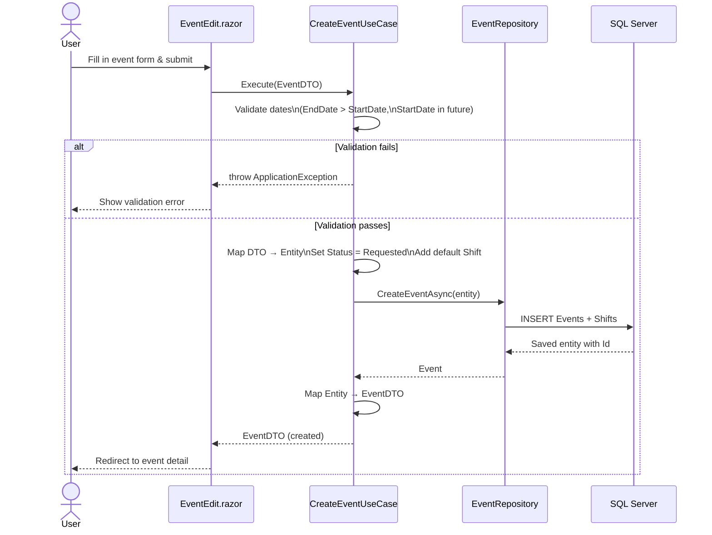
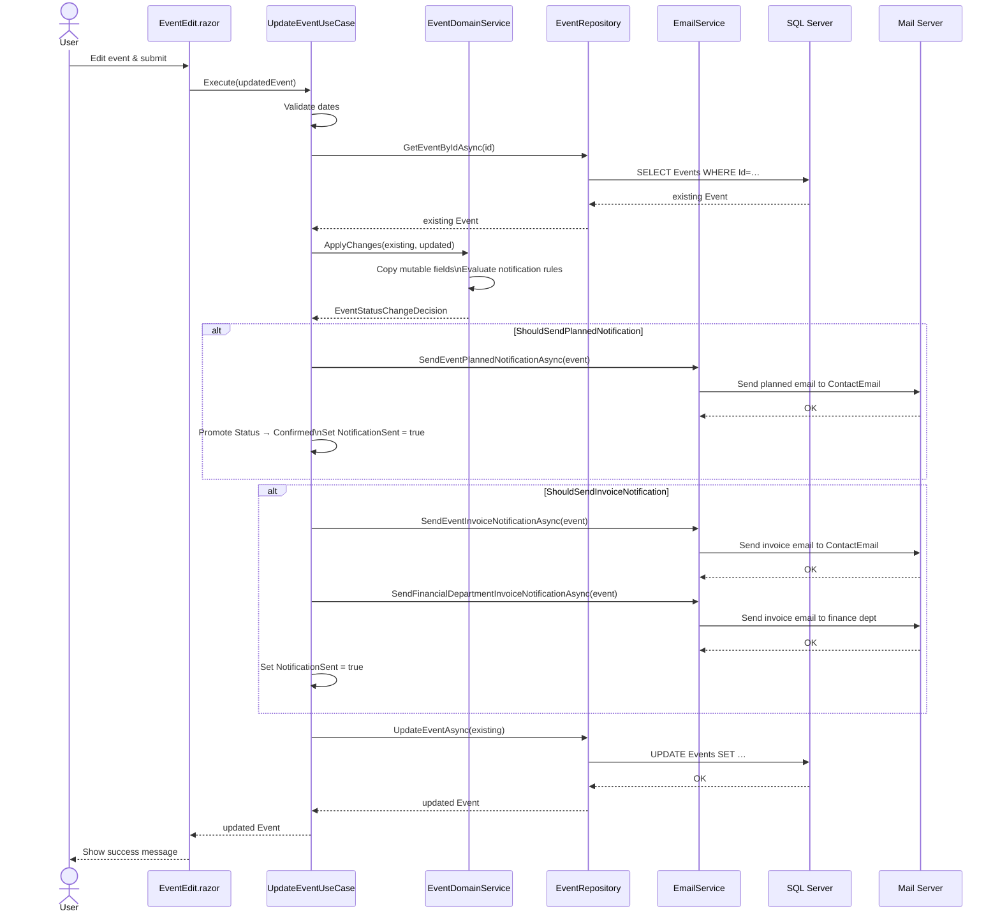
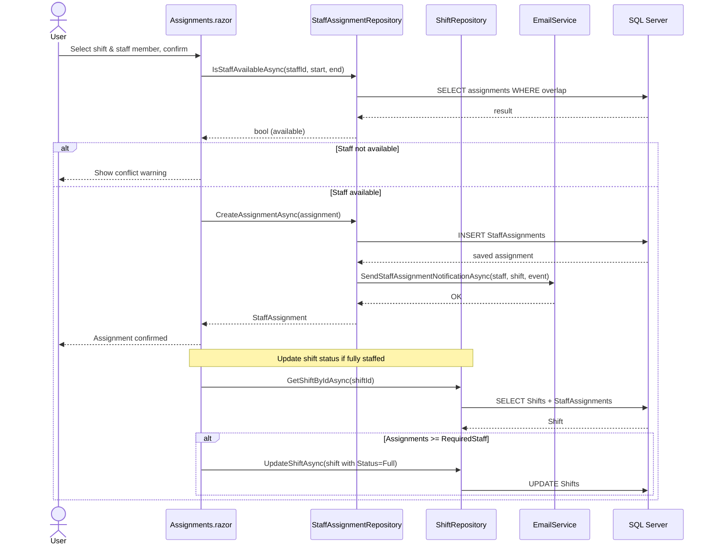

# Architecture Diagrams

This document contains Mermaid diagrams that describe the structure, data model, and key flows of the Medical First Aid Event & Shift Manager solution.

---

## 1. Solution Architecture

The solution follows Clean Architecture with four layers. Dependencies always point inward: outer layers depend on inner layers, never the other way around.

---

## 2. Entity Relationship Diagram

The core domain model that drives the application.

---

## 3. Application Layer Class Diagram

Key classes, interfaces, and their relationships in the Application layer.

> **Note on design inconsistency:** `CreateEventUseCase` correctly uses `EventDTO` as its input/output contract, which keeps domain entities out of the presentation layer. `UpdateEventUseCase` and `EventService` currently use the `Event` domain entity directly — this is a known deviation from the Clean Architecture ideal that should be addressed in a future refactor by introducing an `UpdateEventDTO`.

```mermaid
classDiagram
    class ICreateEventUseCase {
        <<interface>>
        +Execute(EventDTO) Task~EventDTO~
    }
    class IUpdateEventUseCase {
        <<interface>>
        +Execute(Event) Task~Event~
        %% TODO: should accept/return UpdateEventDTO
    }
    class IEventService {
        <<interface>>
        +UpdateEventAsync(Event) Task~Event~
        %% TODO: should accept/return UpdateEventDTO
    }
    class IEventRepository {
        <<interface>>
        +GetAllEventsAsync() Task~List~Event~~
        +GetEventByIdAsync(int) Task~Event~
        +CreateEventAsync(Event) Task~Event~
        +UpdateEventAsync(Event) Task~Event~
        +DeleteEventAsync(int) Task
        +GetUpcomingEventsAsync() Task~List~Event~~
        +GetEventsByDateRangeAsync(DateTime, DateTime) Task~List~Event~~
    }
    class IShiftRepository {
        <<interface>>
        +GetAllShiftsAsync() Task~List~Shift~~
        +GetShiftByIdAsync(int) Task~Shift~
        +GetShiftsByEventIdAsync(int) Task~List~Shift~~
        +CreateShiftAsync(Shift) Task~Shift~
        +UpdateShiftAsync(Shift) Task~Shift~
        +DeleteShiftAsync(int) Task
        +GetUpcomingShiftsAsync() Task~List~Shift~~
        +GetShiftsByDateAsync(DateTime) Task~List~Shift~~
    }
    class IStaffRepository {
        <<interface>>
        +GetAllStaffAsync() Task~List~Staff~~
        +GetStaffByIdAsync(int) Task~Staff~
        +CreateStaffAsync(Staff) Task~Staff~
        +UpdateStaffAsync(Staff) Task~Staff~
        +DeleteStaffAsync(int) Task
        +GetActiveStaffAsync() Task~List~Staff~~
        +GetStaffByRoleAsync(StaffRole) Task~List~Staff~~
        +IsEmailUniqueAsync(string, int?) Task~bool~
    }
    class IStaffAssignmentRepository {
        <<interface>>
        +GetAllAssignmentsAsync() Task~List~StaffAssignment~~
        +GetAssignmentsByShiftIdAsync(int) Task~List~StaffAssignment~~
        +GetAssignmentsByStaffIdAsync(int) Task~List~StaffAssignment~~
        +CreateAssignmentAsync(StaffAssignment) Task~StaffAssignment~
        +UpdateAssignmentAsync(StaffAssignment) Task~StaffAssignment~
        +DeleteAssignmentAsync(int) Task
        +CheckInStaffAsync(int) Task~StaffAssignment~
        +CheckOutStaffAsync(int) Task~StaffAssignment~
        +IsStaffAvailableAsync(int, DateTime, DateTime, int?) Task~bool~
    }
    class IEmailService {
        <<interface>>
        +SendStaffAssignmentNotificationAsync(Staff, Shift, Event) Task
        +SendEventPlannedNotificationAsync(Event) Task
        +SendEventConfirmationNotificationAsync(Event) Task
        +SendEventInvoiceNotificationAsync(Event) Task
        +SendFinancialDepartmentInvoiceNotificationAsync(Event) Task
        +SendEmailAsync(string, string, string) Task
    }
    class CreateEventUseCase {
        -IEventRepository repository
        -ILogger logger
        +Execute(EventDTO) Task~EventDTO~
    }
    class UpdateEventUseCase {
        -IEventRepository _repository
        -IEmailService _emailService
        -ILogger _logger
        -EventDomainService _domainService
        +Execute(Event) Task~Event~
    }
    class EventService {
        -IEventRepository _repository
        -IEmailService _emailService
        -ILogger _logger
        -EventDomainService _domainService
        +UpdateEventAsync(Event) Task~Event~
    }
    class EventDomainService {
        +ApplyChanges(Event, Event) EventStatusChangeDecision
    }
    class EventStatusChangeDecision {
        <<record struct>>
        +bool ShouldSendPlannedNotification
        +bool PromoteToConfirmedAfterPlanned
        +bool ShouldSendInvoiceNotification
    }

    CreateEventUseCase ..|> ICreateEventUseCase
    UpdateEventUseCase ..|> IUpdateEventUseCase
    EventService ..|> IEventService
    CreateEventUseCase --> IEventRepository
    UpdateEventUseCase --> IEventRepository
    UpdateEventUseCase --> IEmailService
    UpdateEventUseCase --> EventDomainService
    EventService --> IEventRepository
    EventService --> IEmailService
    EventService --> EventDomainService
    EventDomainService --> EventStatusChangeDecision
```

---

## 4. EventStatus State Machine

The lifecycle of an `Event` from creation to completion.

---

## 5. ShiftStatus State Machine

The lifecycle of a `Shift` within an event.

---

## 6. Create Event — Sequence Diagram

---

## 7. Update Event — Sequence Diagram (with notification side-effects)

> **Note:** The current implementation passes the `Event` domain entity from the page directly to `UpdateEventUseCase`. Ideally, an `UpdateEventDTO` should be used here (consistent with `CreateEventUseCase`) to preserve layer separation. This is a known technical debt item.

---

## 8. Staff Assignment — Sequence Diagram

